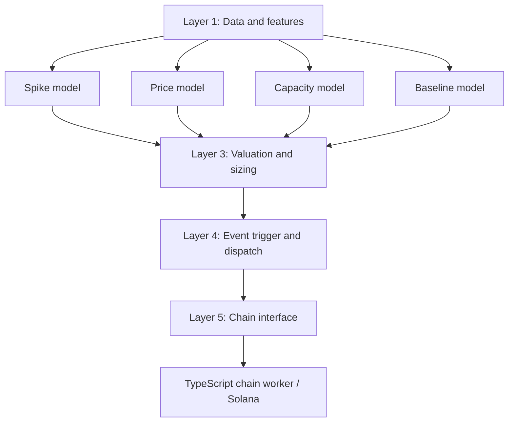
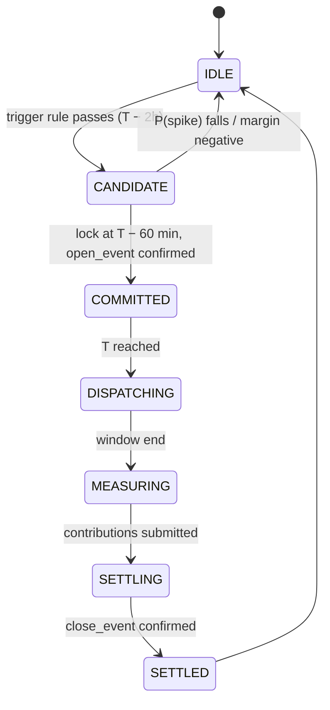

# Model orchestration

*Partly built. The feature layer, spike model and evaluation exist in `ml/` (see [Code layout](#10-code-layout)). The price, capacity, baseline and valuation models, the dispatcher and the orchestrator are still design.*

A virtual power plant (VPP) aggregator: forecasts grid stress, prices and sizes commitments, dispatches home batteries and HVAC, and settles payouts on Solana devnet.

This document covers the Python side: data, models, valuation, dispatch, and the orchestrator that runs them on a simulated clock and hands events to the Solana chain worker. The chain worker's instructions are in [Solana settlement](solana.md#instructions).

## 1. Design principles

1. Forecast, then optimize. ML models predict; a separate valuation and dispatch layer decides.
2. Point-in-time correctness. Every decision at time `t` uses only data that existed at `t`. The feature layer enforces this, not the models.
3. Crude end to end first. Every layer ships a placeholder implementation on day one so one event can flow from data to on-chain payout. Models get upgraded afterward.
4. One process, simple infrastructure. A single Python process with a simulated clock, `asyncio` queues, saved model files, and a YAML config. No Airflow, Kafka, or model server.
5. Fixed contracts between layers. Each layer consumes and produces typed objects (Section 6), so team members can work in parallel.

## 2. Layer overview



| Layer | Responsibility | Runs |
|---|---|---|
| 1. Data and features | Point-in-time feature rows per interval and per home | Every tick |
| 2. Forecast models | Spike probability, expected prices, deliverable kW, baselines | Every tick (spike, capacity); at lock time (price, baseline) |
| 3. Valuation and sizing | Fair value, locked price, committed kWh, collateral | At lock time |
| 4. Trigger and dispatch | Event lifecycle decisions; per-interval home targets | Every tick |
| 5. Chain interface | Emits proposals and delivery reports; receives confirmations | On state transitions |

A tick is one 15-minute simulated interval.

## 3. Layer details

### 3.1 Layer 1: Data and features

Inputs (pre-downloaded Parquet, UTC timestamps):

| Dataset | Source | Key columns |
|---|---|---|
| Real-time prices | ERCOT via `gridstatus` | `ts`, `lz_austin_price` |
| Load forecasts (as issued) | ERCOT Public API archives | `issued_at`, `target_ts`, `forecast_mw` |
| Outages | ERCOT unplanned outages / outage capacity | `ts`, `outage_mw` |
| Weather forecasts (as issued) | Open-Meteo Historical Forecast API | `issued_at`, `target_ts`, `temp_f`, `cloud_cover` |
| Weather actuals | Open-Meteo Historical Weather API | `ts`, `temp_f` |
| Household circuits | Pecan Street Kaggle sample | `ts`, `home_id`, `grid_kw`, `hvac_kw`, `solar_kw` |
| Solar profiles | PVWatts v8 | `ts`, `home_id`, `solar_kw` |
| Training load profiles | ResStock (optional) | `ts`, `profile_id`, `load_kw` |

Grid feature row (one per tick):

| Group | Features |
|---|---|
| Calendar | hour, day of week, holiday flag, month |
| Weather | forecast temp at t+1..t+6h, forecast cloud cover, temp change vs. yesterday |
| Grid | latest issued load forecast for t+1..t+6h, outage MW, price lags (t−1, t−4, t−96), rolling price max over 24h |

Home feature row (one per home per tick):

| Group | Features |
|---|---|
| State | battery state of charge, reserve floor, solar capacity |
| Behavior | load lags (t−1, t−4, same interval yesterday, same interval last week), HVAC share of load |
| Weather | actual temp (baseline training) or forecast temp (live decisions) |

Point-in-time rule. Forecast-type inputs are joined on `issued_at <= t`, taking the latest issue. Actuals are joined only on `ts < t`. Enforce this inside `features.py` so no model can accidentally see the future.

```python
def grid_features(t: datetime) -> GridFeatures: ...
def home_features(t: datetime, home_id: str, mode: Literal["live", "train"]) -> HomeFeatures: ...
```

### 3.2 Layer 2: Forecast models

| Model | Type | Target | Output | Evaluation |
|---|---|---|---|---|
| Spike | LightGBM classifier | price > `spike_threshold` within horizon h | `P(spike)` for h = 1..6 hours | PR-AUC, calibration plot |
| Price | Conditional averages → LightGBM quantile regression | price in event window | `E[price | spike]`, `E[price | no spike]`, 10th and 90th percentiles | MAE, interval coverage |
| Capacity | Simulation logic + PVWatts + load forecast | deliverable kW per home | typical and low (10th percentile) kW | Coverage of low estimate |
| Baseline | LightGBM regressor, trained on non-event days | home load with no event | kWh per interval per home | MAE on held-out normal days |

Capacity calculation per home, per interval in the window:

```
battery_kw  = min(max_discharge_kw, (soc_kwh − reserve_kwh) / window_hours)
solar_kw    = max(0, solar_forecast_kw − load_forecast_kw)
hvac_kw     = hvac_forecast_kw × hvac_shed_fraction
deliverable = battery_kw + solar_kw + hvac_kw
```

The low estimate uses the low solar forecast, the high load forecast, and the projected state of charge after pre-positioning.

Interfaces:

```python
class SpikeModel:
    def predict(self, x: GridFeatures) -> dict[int, float]: ...        # horizon_h -> P(spike)

class PriceModel:
    def predict(self, x: GridFeatures, window: Window) -> PriceForecast: ...

class CapacityModel:
    def predict(self, t: datetime, home: HomeState, window: Window) -> CapacityForecast: ...

class BaselineModel:
    def predict(self, home_id: str, window: Window) -> list[float]: ...  # kWh per interval
```

Placeholder versions (day one): spike returns a constant 0.2; price returns historical hourly means; capacity uses fixed battery math with no solar; baseline returns the same interval's usage from the previous day.

### 3.3 Layer 3: Valuation and sizing

```
fair_value   = P(spike) × E[price | spike] + (1 − P(spike)) × E[price | no spike]
risk_buffer  = buffer_k × (price_p50 − price_p10)          # or a fixed % in v1
locked_price = fair_value − risk_buffer − aggregator_fee
committed_kwh(home) = low_capacity_kw(home) × window_hours
collateral   = locked_price × Σ committed_kwh
```

Prices are converted from $/MWh (ERCOT) to $/kWh before this step.

```python
def value_event(p_spike: float, price: PriceForecast, cfg: Config) -> Valuation: ...
def size_commitments(capacity: dict[str, CapacityForecast], window: Window) -> dict[str, float]: ...
```

Guardrails: skip the event if `locked_price <= min_locked_price` or if total committed kWh is below `min_event_kwh`.

### 3.4 Layer 4: Event trigger and dispatch

Trigger rule (evaluated every tick while `IDLE`):

```
open candidate if  P(spike, lead_time) >= trigger_threshold
               and expected_margin > min_margin
expected_margin = (fair_value − locked_price) × Σ committed_kwh
```

Pre-positioning (T − 60 min to T): batteries charge from the grid or solar toward `target_soc`, or hold if already there. Homes stop using battery for self-consumption.

Dispatch (each tick from T to end):

1. Mock grid operator issues a MW target (Section 3.6).
2. Optimizer splits the target across homes.

LP formulation (`cvxpy` or `PuLP`), per tick:

```
maximize    Σ_h delivered_h − penalty × shortfall
subject to  delivered_h = battery_h + hvac_cut_h + solar_export_h
            0 <= battery_h <= min(max_discharge_h, (soc_h − reserve_h) / Δt)
            0 <= hvac_cut_h <= hvac_load_h × hvac_shed_fraction
            Σ_h delivered_h + shortfall >= target
            delivered_h <= committed_rate_h × over_delivery_cap
```

Fallback dispatcher: allocate the target proportional to each home's remaining deliverable kW. Use it if the LP fails or exceeds `lp_timeout_ms`.

```python
def should_open(t: datetime, spike: dict[int, float], cfg: Config) -> bool: ...
def preposition(homes: list[HomeState], cfg: Config) -> list[HomeAction]: ...
def dispatch(target_kw: float, homes: list[HomeState], cfg: Config) -> list[HomeAction]: ...
```

### 3.5 Layer 5: Chain interface

Converts state transitions into messages for the TypeScript chain worker and records confirmations. Message schemas are in Section 6.

| Transition | Message out | Chain instruction |
|---|---|---|
| `CANDIDATE → COMMITTED` | `EventProposal` | `open_event` (with collateral) |
| `MEASURING → SETTLING` | `ContributionReport` per home | `submit_contribution` |
| `SETTLING → SETTLED` | `SettlementReport` | `close_event`, then `claim_payout` per home |

The orchestrator does not advance past `COMMITTED` until the worker confirms `open_event`.

### 3.6 Mock grid operator

Stands in for ERCOT and the QSE.

- Dispatch: each tick of an open event, if the historical real-time price ≥ the fleet's offer price, issue `target_kw = min(offered_kw, Σ committed rate)`. Otherwise target 0.
- Settlement: `revenue = Σ_ticks delivered_kwh × historical_price_per_kwh`, deposited into the vault via the `close_event` message.

```python
class MockGrid:
    def target(self, t: datetime, offer: Offer) -> float: ...
    def settle(self, event: Event, deliveries: dict[str, float]) -> float: ...
```

## 4. Event lifecycle

### 4.1 State machine



Only one event is active at a time in v1. A cooldown (`cooldown_ticks`) prevents back-to-back events on the same homes.

### 4.2 Timeline

| Simulated time | Action | Models run | Chain |
|---|---|---|---|
| Every tick | Build features; update home state | Spike, capacity | — |
| T − 2 h | Trigger rule passes → `CANDIDATE` | — | — |
| T − 2 h to T − 60 min | Re-check each tick; cancel if trigger fails twice in a row | Spike | — |
| T − 60 min | Lock terms: fair value, locked price, commitments, baselines, hash | Price, baseline, capacity (low) | `open_event` |
| T − 60 min to T | Pre-position batteries | — | — |
| T to end | Each tick: grid target → LP dispatch → apply actions | — | — |
| End | Measure delivery vs. committed baselines | — | `submit_contribution` × homes |
| End + 1 tick | Mock grid settles at historical prices | — | `close_event`, `claim_payout` × homes |
| After | Write event record to evaluation log | — | — |

### 4.3 Delivery measurement

Per home, per event:

```
delivered_kwh = Σ_ticks ( baseline_kwh − actual_grid_kwh )
```

`actual_grid_kwh` is net grid draw (negative when exporting), so battery discharge, solar export, and HVAC cuts all count. Payout is `min(delivered_kwh, committed_kwh) × locked_price`. Delivery below `committed_kwh × shortfall_tolerance` is flagged in the evaluation log.

### 4.4 Baseline commitment

At lock time:

1. Baseline model produces kWh per interval for each home.
2. Serialize as canonical JSON (sorted keys, fixed decimal places).
3. `baseline_hash = sha256(json_bytes)`, included in `EventProposal`.
4. Store the JSON under `artifacts/baselines/{event_id}.json` so the dashboard can re-hash and verify.

## 5. The orchestrator loop

```python
class Orchestrator:
    def __init__(self, cfg, clock, models, grid, bus):
        self.state = "IDLE"
        self.event: Event | None = None

    async def run(self):
        async for t in self.clock.ticks():            # 15-min simulated steps
            gx = features.grid_features(t)
            homes = self.update_homes(t)
            spike = self.models.spike.predict(gx)
            await self.bus.publish("tick", TickSnapshot(t, spike, homes))

            match self.state:
                case "IDLE":
                    if self.cooldown_ok(t) and should_open(t, spike, self.cfg):
                        self.event = self.new_candidate(t)
                        self.transition("CANDIDATE")
                case "CANDIDATE":
                    if t >= self.event.lock_time:
                        proposal = self.lock_terms(t, gx, homes)
                        if proposal is None:
                            self.transition("IDLE")
                        else:
                            await self.bus.publish("chain.open_event", proposal)
                            await self.wait_confirm("open_event")
                            self.transition("COMMITTED")
                    elif self.trigger_failed_twice(spike):
                        self.transition("IDLE")
                case "COMMITTED":
                    self.apply(preposition(homes, self.cfg))
                    if t >= self.event.start:
                        self.transition("DISPATCHING")
                case "DISPATCHING":
                    target = self.grid.target(t, self.event.offer)
                    self.apply(dispatch(target, homes, self.cfg))
                    if t >= self.event.end:
                        self.transition("MEASURING")
                case "MEASURING":
                    for report in self.measure_delivery():
                        await self.bus.publish("chain.contribution", report)
                    self.transition("SETTLING")
                case "SETTLING":
                    revenue = self.grid.settle(self.event, self.deliveries)
                    await self.bus.publish("chain.close_event", SettlementReport(...))
                    await self.wait_confirm("close_event")
                    self.log_event()
                    self.transition("SETTLED")
                case "SETTLED":
                    self.transition("IDLE")
```

Clock. `SimClock(start, end, step=15min, speed=...)`. At demo speed, one simulated day takes about three real minutes. In backtest mode the clock runs as fast as possible and chain messages go to a stub instead of the worker.

Bus topics:

| Topic | Consumer | Payload |
|---|---|---|
| `tick` | Dashboard WebSocket | `TickSnapshot` |
| `state` | Dashboard, evaluation log | `StateChange` |
| `chain.open_event` | Chain worker | `EventProposal` |
| `chain.contribution` | Chain worker | `ContributionReport` |
| `chain.close_event` | Chain worker | `SettlementReport` |
| `chain.confirm` | Orchestrator | `{instruction, event_id, tx_sig}` |

## 6. Data contracts

All monetary values in mock-USDC; energy in kWh; timestamps in UTC ISO 8601.

```json
EventProposal {
  "event_id": "evt_20230817_2200",
  "start": "2023-08-17T22:00:00Z",
  "end": "2023-08-18T00:00:00Z",
  "fair_value_per_kwh": 0.61,
  "locked_price_per_kwh": 0.42,
  "commitments": [{ "home_id": "h03", "kwh": 6.5 }],
  "baseline_hash": "9f2c...e1",
  "collateral": 118.30,
  "model_version": "spike-v3/price-v2/baseline-v2"
}

ContributionReport {
  "event_id": "evt_20230817_2200",
  "home_id": "h03",
  "delivered_kwh": 6.8,
  "payable_kwh": 6.5,
  "meter_pubkey": "7xKX...",
  "meter_signature": "3Jf9..."
}

SettlementReport {
  "event_id": "evt_20230817_2200",
  "revenue": 164.10,
  "total_payable_kwh": 281.6,
  "total_payout": 118.27,
  "aggregator_margin": 45.83
}
```

Values shown are placeholders. The chain worker signs each `ContributionReport` transaction with the home's meter keypair; the aggregator wallet pays fees.

## 7. Configuration

`orchestrator/config.yaml`:

```yaml
clock:
  step_minutes: 15
  demo_speed: 480            # simulated seconds per real second

market:
  settlement_point: LZ_AUSTIN
  spike_threshold_mwh: 500   # $/MWh; tune in backtest

trigger:
  lead_time_hours: 2
  lock_minutes_before: 60
  threshold: 0.35
  min_margin: 5.0
  cooldown_ticks: 8
  window_hours: 2

valuation:
  aggregator_fee_per_kwh: 0.03
  buffer_k: 0.5
  min_locked_price_per_kwh: 0.10
  min_event_kwh: 20

fleet:
  battery_kwh: 13.5          # illustrative; from spec sheet
  max_discharge_kw: 5.0
  reserve_fraction: 0.30
  target_soc: 0.95
  hvac_shed_fraction: 0.30

dispatch:
  solver: lp                 # lp | proportional
  lp_timeout_ms: 500
  shortfall_penalty: 10.0
  over_delivery_cap: 1.2
  shortfall_tolerance: 0.8
```

All thresholds are starting points to tune in the backtest.

## 8. Failure handling

| Failure | Response |
|---|---|
| A model raises or returns NaN | Use that model's placeholder version for this tick; log a warning |
| LP infeasible or times out | Proportional fallback dispatcher |
| Chain confirmation not received within timeout | Retry up to 3 times; then pause the clock and surface the error on the dashboard |
| `lock_terms` produces no viable commitments | Cancel candidate → `IDLE` |
| Home under-delivers | Pay only delivered kWh (up to commitment); flag in evaluation log |
| Missing data for an interval | Forward-fill up to 2 ticks; otherwise skip trigger evaluation for that tick |

## 9. Backtest and evaluation

Split: train on data before the demo window; test on held-out summers and the Pecan Street 4CP days. Never tune thresholds on the test window.

Strategies compared (same replay, same homes):

1. No optimization: batteries only self-consume.
2. Simple rule: discharge whenever price > threshold.
3. Full pipeline: forecast, lock, pre-position, LP dispatch.

Event log (`artifacts/events.parquet`, one row per event): event ID, timestamps, P(spike) at lock, fair value, locked price, realized average price, committed kWh, delivered kWh, revenue, payout, margin, strategy.

Dashboard evaluation views:

1. Spike calibration: predicted probability bins vs. observed spike frequency.
2. Locked vs. realized price per event.
3. Cumulative aggregator margin.
4. Strategy comparison: earnings per home and kWh delivered during peaks.

## 10. Code layout

Files marked *built* exist today; the rest are planned.

```
ml/
├── ingest.py             # built: ERCOT prices and weather ingestion
├── features.py           # built: point-in-time feature rows
├── spike_model.py        # built: LightGBM classifier + calibration
├── evaluate.py           # built: walk-forward and seasonality evaluation
├── train_spike_model.py  # built: training entry point
├── price_model.py      # conditional expected price, quantiles
├── capacity.py         # deliverable kW, typical + low
├── baseline.py         # counterfactual usage
├── valuation.py        # fair value, locked price, sizing
├── backtest.py         # replay + strategy comparison
└── artifacts/          # saved models, baselines, event log
orchestrator/
├── clock.py            # SimClock
├── events.py           # Event, state machine
├── orchestrator.py     # main loop
├── dispatch.py         # preposition, LP, proportional fallback
├── mock_grid.py        # targets + settlement
├── bus.py              # asyncio topics
├── contracts.py        # EventProposal, ContributionReport, SettlementReport
└── config.yaml
```

## 11. Build order

| Step | Deliverable | Done when |
|---|---|---|
| 1 | Contracts + config + placeholder models | Schemas agreed with the Solana owner |
| 2 | Feature layer with point-in-time joins | Feature rows build for any `t` in the replay |
| 3 | Clock, state machine, mock grid, proportional dispatcher | One event runs end to end against a chain stub |
| 4 | Chain worker integration | One event settles on devnet with Explorer links |
| 5 | Spike model v1 | Calibrated probabilities replace the constant |
| 6 | Price model + valuation | Locked prices come from forecasts |
| 7 | Baseline model + hash commitment | Dashboard verifies baselines |
| 8 | LP dispatcher | Beats proportional dispatch in backtest |
| 9 | Backtest + evaluation views | Strategy comparison chart ready for the demo |

Step 4 is the integration checkpoint. Everything after it improves quality without changing the pipeline's shape.
